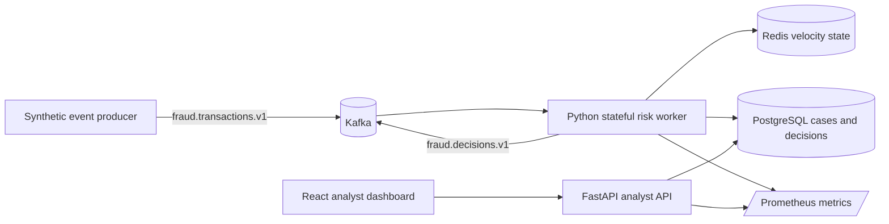

# FraudWatch Streaming Lab Architecture

## Scope and data boundary

FraudWatch is a **portfolio demonstration**, not a payment-decision service. Every transaction is a deterministic synthetic event created for local validation. The application intentionally has no cardholder name, card number, bank account, merchant account, or real payment connector. Its output is an explainable analyst-review recommendation, never an automatic financial action.

## Streaming topology

Kafka separates the producer from the decision worker. The worker consumes only the `fraud.transactions.v1` topic, uses a synthetic event ID as the idempotency key, and emits a decision to `fraud.decisions.v1`. Redis provides a short-window velocity feature in the container topology, while the local test mode uses an equivalent deterministic in-memory implementation. PostgreSQL holds normalized event, decision, case, and audit records.

## Decision contract

Each event is assigned an interpretable score from independently visible rules. The default policy combines high-value transactions, rapid repeat activity, new-device signals, and geo-distance anomalies. The result is one of `allow`, `review`, or `block`, with the score and matched rule codes stored alongside the event. A `block` in this lab is a simulated decision only; it cannot affect a card, account, or payment system.

## Local modes

| Mode | Components | Intended use |
|---|---|---|
| Deterministic test mode | Python scoring engine, in-memory velocity store, API, React dashboard | Automated tests and a runnable local demonstration without containers. |
| Streaming lab | Kafka, Python producer and worker, Redis, PostgreSQL, API, React, Prometheus, Grafana | Full local Docker Compose topology for interviews and architecture walkthroughs. |

## Security and reliability controls

The topic names are versioned and separated by direction. Consumer offset commits occur only after a decision has been durably accepted by the worker abstraction. The worker treats duplicate event IDs as idempotent and maintains short-lived velocity state by account token rather than raw account data. Container credentials are configured at runtime, excluded from source control, and intended to be replaced by a secret manager in a real deployment. The repository documents operational boundaries rather than claiming production financial compliance.
